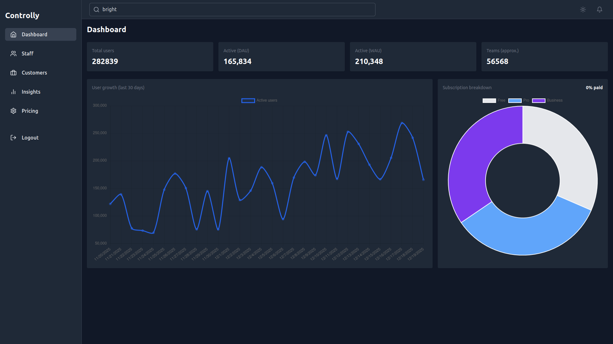

# Controlly

Controlly is a production-style, design-focused admin and product insights dashboard built with **React + TypeScript, Vite, and Tailwind CSS**. This repository is a **front-end design prototype** that demonstrates realistic UI, architecture, and user flows (auth, role-based access, staff & customer management, pricing, analytics charts). All backend interactions are simulated using a local mock API and persisted in the browser via `localStorage`.

---

## Dashboard Preview

<p>
  
</p>

---

## Live UI Demo

<video src="./assets/demo.mp4"
       autoplay
       loop
       muted
       controls
       width="720"  
/>


## 🔑 Highlights

- **Purpose:** Design & front-end prototype — not a production backend.  
- **Mock backend:** All data fetch & mutation are simulated in `mockApi.ts` and persisted to `localStorage` (JSON).  
- **Tech:** React, TypeScript, Vite, Tailwind CSS, Chart.js (`react-chartjs-2`).  
- **Auth & Roles:** Mocked `AuthContext` (Admin / Staff) for UX demos — no secure auth implemented.  

> ⚠️ This project is intended for demonstration, UI design, and prototyping only. Do not use it for production data or security-sensitive contexts.

---

## 🚀 Features

- Role-aware UI & protected routes (Admin vs Staff)  
- Staff (internal) management: list, create/edit, activate/deactivate  
- Customers (external) listing with seat counts and last-active  
- Product Insights: DAU/WAU, feature usage charts (Line, Bar, Doughnut)  
- Pricing page with editable plan limits (Admin only)  
- Global search (`/search?q=...`) across staff & customers  
- Dark / Light theme with persisted preference  
- Mobile responsive layout, off-canvas sidebar, toast & modal components  
- Accessibility improvements (aria attributes, focus handling) — some a11y TODOs remain  

---

## 📁 Project Structure (High Level)

<pre>
    src
    ├── App.tsx
    ├── assets
    ├── components
    │ ├── Header.tsx
    │ ├── Modal.tsx
    │ ├── ProtectedRoute.tsx
    │ ├── Sidebar.tsx
    │ └── ToastProvider.tsx
    ├── contexts
    │ ├── AuthContext.tsx
    │ └── ThemeContext.tsx
    ├── data
    ├── hooks
    │ ├── useAsync.ts
    │ └── useDebouncedValue.ts
    ├── index.css
    ├── layouts
    │ └── MainLayout.tsx
    ├── main.tsx
    ├── pages
    │ ├── Customers.tsx
    │ ├── Dashboard.tsx
    │ ├── Insights.tsx
    │ ├── Login.tsx
    │ ├── Pricing.tsx
    │ ├── Search.tsx
    │ └── Staff.tsx
    ├── services
    │ └── mockApi.ts
    ├── styles
    ├── types.ts
    └── utils
</pre>


---

## 🔧 Key Files & Responsibilities

| File               | Purpose                                                                                       |
|-------------------|------------------------------------------------------------------------------------------------|
| `mockApi.ts`       | Simulated backend & seeding; `localStorage` persistence (`controlly:users`, `controlly:customers`, `controlly:plans`) |
| `AuthContext.tsx`  | Mocked authentication & role context                                                          |
| `ProtectedRoute.tsx` | Route-level role checks                                                                     |
| `Insights.tsx`     | Charts & analytics UI                                                                         |
| `Pricing.tsx`      | Pricing display + admin edit flows                                                            |
| `Search.tsx`       | Global search UI for staff & customers                                                        |

---

## 🛠️ Getting Started (Dev)

**Prerequisites:** Node.js, npm (or Yarn)

### Install dependencies

```bash
npm install
# or
yarn
```

### Run dev server

```bash
npm run dev
```

### Build and serve preview

```bash
npm run build
npm run preview
```


## 📦 Data & Mock Backend Details

`mockApi.ts` seeds sample data if keys are missing and simulates network delay.

LocalStorage keys used:

```text
controlly:users

controlly:customers

controlly:plans
```

Metrics (DAU/WAU, feature usage) are synthetically generated and scaled to customer seats for realism.


## Reset Demo Data (Dev)
 Run in browser devtools console or in a script

```javascript
localStorage.removeItem('controlly:users');
localStorage.removeItem('controlly:customers');
localStorage.removeItem('controlly:plans');
```

Reloading the app will re-seed demo data.


## ⚠️ Limitations & Assumptions

- No server-side authentication or database; everything runs client-side.

- Data persisted in localStorage — insecure and ephemeral.

- Business logic and role checks are front-end simulations — server-side enforcement is not implemented.

- Analytics are mock/synthetic for UI demonstration (not reliable for production insights).

- Accessibility: improved in many areas, but not fully audited (e.g., focus-trap for sidebar is a TODO).

- Minimal test coverage — add tests for production readiness.


## ✅ Recommended Next Steps to Productionize

- Replace mockApi with a real backend (REST/GraphQL), database, and server-side roles

- Implement secure authentication (JWT/session-based) and server-side authorization

- Add automated tests (unit, integration, E2E) and CI pipeline

- Improve accessibility and run a11y tests (axe, Lighthouse)

- Add proper monitoring/observability for production analytics